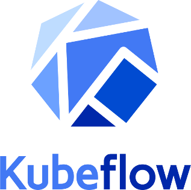
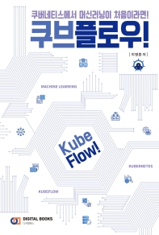

# Kubeflow
- 매일 아침 쿠브플로우 공부
- OS: OSX(mac), Window, Ubuntu 18.04
- Editor : VisualCode(vsCode)
- Author : GloryKim (https://github.com/GloryKim)

  

## Contents
01. 머신러닝 기초

## Reference
- [쿠브플로우 쿠버네티스에서 머신러닝이 처음이라면!](http://www.kyobobook.co.kr/product/detailViewKor.laf?mallGb=KOR&barcode=9788960883055)

  
 
쿠브플로우 쿠버네티스에서 머신러닝이 처음이라면!

